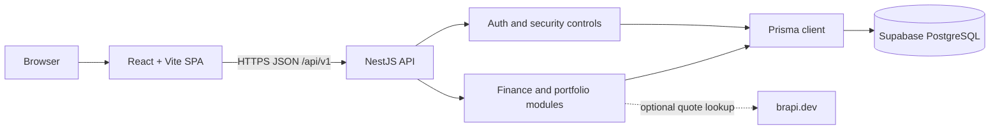

# FinanceBuddy

[](https://github.com/salmoriadev/FinanceBuddy/actions/workflows/ci.yml)
[](https://github.com/salmoriadev/FinanceBuddy/actions/workflows/security.yml)
[](./LICENSE)

FinanceBuddy is a security-conscious personal finance platform that brings cash flow, budgets, savings goals, reports, and investment tracking into one focused workspace. It is an open-source portfolio project built to demonstrate full-stack product engineering, explicit trust boundaries, and repeatable quality gates—not a banking product or financial adviser.

<p align="center">
  
</p>

## What it does

- Tracks income, expenses, categories, filters, and recurring transactions.
- Monitors monthly budgets and savings goals with clear progress views.
- Builds reports for balance, cash flow, category distribution, and period comparisons.
- Records assets, portfolio transactions, position snapshots, dividends, and monthly portfolio summaries.
- Supports manual quotes plus optional market-data lookup, with clearly identified estimated/mock fallback data for development.
- Provides English and Brazilian Portuguese preferences with configurable display currency.

## Why it is a strong engineering case study

### Product engineering

- React 18 SPA with route-level lazy loading, TanStack Query caching, typed API mapping, Tailwind CSS, shadcn/ui primitives, and Recharts.
- Modular NestJS 11 API with DTO validation, Prisma repositories, explicit service boundaries, and development-only OpenAPI documentation.
- PostgreSQL schema managed as ordered Supabase SQL migrations, while Prisma provides the application data model and generated client.
- npm workspaces with one lockfile and a single quality command covering tests, lint, typechecking, and production builds.

### Security engineering

- Argon2id password hashing with optional server-side peppering.
- Short-lived JWT access tokens and hashed, rotating refresh tokens in HttpOnly cookies.
- Refresh-token family tracking and reuse detection.
- Double-submit CSRF protection for cookie-authenticated session operations.
- Global and route-specific throttling, explicit request-size limits, strict DTO validation, and controlled CORS/proxy configuration.
- User-scoped repository queries and anti-enumeration behavior for financial resources.
- Security event persistence plus an administrative review endpoint allowlisted by immutable user UUID.
- CI gates for tests, lint, typechecking, builds, dependency audit, secret scanning, SAST, and filesystem vulnerability scanning.

## Architecture



The browser never connects directly to PostgreSQL. The NestJS API owns authentication, validation, authorization, business rules, and persistence. Supabase is used as managed PostgreSQL; FinanceBuddy does not use Supabase client-side authentication.

## Repository map

```text
.
├── apps/
│   ├── api/                  # NestJS API, Prisma model, and Jest tests
│   └── web/                  # React/Vite SPA and Vitest tests
├── supabase/migrations/      # Ordered SQL migration history
├── docs/security/            # Security requirements and deployment guidance
├── .github/workflows/        # Quality and security CI
├── SECURITY.md               # Reporting policy and implemented controls
└── package.json              # npm workspace orchestration
```

## Prerequisites

- [Node.js](https://nodejs.org/) `>=22.12`
- npm (included with Node.js)
- A [Supabase](https://supabase.com/) project providing PostgreSQL
- Git; OpenSSL is recommended for generating local secrets

## Local setup

### 1. Clone and install

```bash
git clone https://github.com/salmoriadev/FinanceBuddy.git
cd FinanceBuddy
npm ci
```

### 2. Create local environment files

```bash
cp apps/api/.env.example apps/api/.env
cp apps/web/.env.example apps/web/.env
```

Set the API values for your own Supabase project. Never commit either `.env` file.

```dotenv
# apps/api/.env
DATABASE_URL="postgresql://postgres:<password>@<host>:5432/postgres"
AUTH_JWT_SECRET="replace-with-output-from-openssl-rand-base64-48"
AUTH_JWT_ISSUER="financebuddy"
AUTH_JWT_AUD="financebuddy"
PASSWORD_PEPPER="replace-with-an-independent-secret"
ACCESS_TOKEN_TTL_MINUTES=15
REFRESH_TOKEN_TTL_DAYS=30
CORS_ORIGIN="http://localhost:8080"
COOKIE_DOMAIN=""
COOKIE_SAMESITE="lax"
TRUST_PROXY="false"
SECURITY_ADMIN_USER_IDS=""
REQUEST_BODY_LIMIT=100kb
PORT=4000
ENABLE_SWAGGER=true
BRAPI_TOKEN=""
MARKET_DATA_ENABLE_MOCK_FALLBACK="true"
```

Generate independent development secrets, for example:

```bash
openssl rand -base64 48
openssl rand -base64 32
```

Point the web app at the local API:

```dotenv
# apps/web/.env
VITE_API_URL="http://localhost:4000/api/v1"
```

The complete templates are in [`apps/api/.env.example`](./apps/api/.env.example) and [`apps/web/.env.example`](./apps/web/.env.example).

### 3. Apply the database migrations

Create an empty Supabase project, open its SQL Editor, and apply every file in [`supabase/migrations`](./supabase/migrations) in ascending timestamp order. The filenames are the migration order, beginning with `20260130090000_base_schema.sql`.

The SQL files in `supabase/migrations/` are the source of truth for schema changes. Do **not** replace this step with `prisma migrate dev`: this repository does not contain a Prisma migration history. Prisma is used for schema mapping and client generation after the SQL migrations have been applied.

### 4. Generate the client and run both apps

```bash
npm run prisma:generate --workspace=apps/api
```

In separate terminals:

```bash
npm run dev:api
npm run dev:web
```

- Web app: `http://localhost:8080`
- API health check: `http://localhost:4000/api/v1/health`
- Swagger in development: `http://localhost:4000/docs`

Swagger is intentionally unavailable when `NODE_ENV=production`.

## Scripts and quality gates

| Command | Purpose |
| --- | --- |
| `npm run dev:web` | Start the Vite development server. |
| `npm run dev:api` | Start NestJS in watch mode. |
| `npm test` | Run API and web test suites. |
| `npm run lint` | Lint the web workspace. |
| `npm run typecheck` | Typecheck both workspaces. |
| `npm run build` | Build both workspaces for production. |
| `npm run check:fast` | Run tests, lint, and typechecking. |
| `npm run check` | Run the complete local quality gate, including both builds. |
| `npm audit --audit-level=high` | Fail on high or critical npm advisories. |

Pull requests run the same quality checks in GitHub Actions. The separate security workflow blocks on high/critical dependency findings and also runs Gitleaks, Semgrep, and Trivy filesystem scanning.

## Deployment notes

The repository includes SPA rewrite configuration for deploying `apps/web` to Vercel. Set the Vercel root directory to `apps/web` and configure `VITE_API_URL` with the public `/api/v1` URL of your API.

The API can run on a Node.js host that supports Node `>=22.12`, a build command of `npm run build:api`, and a start command of `npm run start:api`. API infrastructure is intentionally not prescribed in this repository. Before deploying:

1. Apply the Supabase SQL migrations to the target database.
2. Store all API secrets in the hosting provider, never in the repository.
3. Set an exact `CORS_ORIGIN`; do not use a wildcard with credentials.
4. Select the correct cookie `SameSite` policy for the web/API topology.
5. Enable `TRUST_PROXY` only behind a known proxy that overwrites forwarded headers.
6. Disable development mock market data in production unless that behavior is explicitly desired.

Review the [`deployment security checklist`](./docs/security/DEPLOYMENT_SECURITY.md) before exposing the application publicly.

## Security and data disclaimer

Please report vulnerabilities privately through the process in [`SECURITY.md`](./SECURITY.md). Do not place secrets, access tokens, database URLs, vulnerability details, or real financial data in issues, discussions, screenshots, fixtures, or pull requests.

FinanceBuddy is a portfolio and educational project. It has not been independently audited, is not banking infrastructure, and does not provide financial, investment, tax, or legal advice. Use synthetic data in public or shared environments.

## Contributing

Contributions are welcome. Read [`CONTRIBUTING.md`](./CONTRIBUTING.md) for setup, branch, commit, test, pull-request, and data-safety expectations.

## License

Copyright © 2026 Arthur de Farias Salmoria. Released under the [MIT License](./LICENSE).
