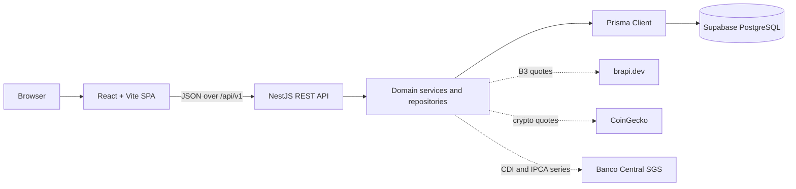

# FinanceBuddy

[](https://github.com/salmoriadev/FinanceBuddy/actions/workflows/ci.yml)
[](https://github.com/salmoriadev/FinanceBuddy/actions/workflows/security.yml)
[](./LICENSE)

FinanceBuddy is a full-stack personal finance app for recording day-to-day cash flow and following investments from the same account. It combines transactions, monthly budgets, savings goals, reports, and portfolio activity in a Brazilian Portuguese interface, with BRL and USD display-currency preferences.

<p align="center">
  
</p>

FinanceBuddy does not connect to a bank or brokerage and does not execute financial operations. Users enter their own records; market lookup is the only optional external data source. The project is pre-1.0 and is not banking infrastructure or a source of financial, investment, tax, or legal advice.

## Contents

- [Product overview](#product-overview)
- [Architecture](#architecture)
- [Technology](#technology)
- [Repository structure](#repository-structure)
- [Run locally](#run-locally)
- [Development commands](#development-commands)
- [Market data](#market-data)
- [Deployment](#deployment)
- [Contributing](#contributing)

## Product overview

The application is organized around the records people use to understand their finances over time:

- **Cash flow:** create income and expense transactions, organize them by category, filter the history, and mark monthly entries as recurring.
- **Budgets:** set a monthly spending limit for a category and compare the limit with transactions recorded for that period.
- **Savings goals:** track a target amount, the current amount, a deadline, and the progress toward the goal.
- **Reports:** review yearly income, expenses, balance, savings rate, monthly trends, category distribution, and the change from the previous month.
- **Investments:** register assets and portfolio transactions, refresh or enter quotes, inspect positions, record dividends, and view monthly portfolio summaries.
- **Preferences:** display monetary values in BRL or USD while interface copy, dates, and number formats remain consistent with Brazilian Portuguese.

Accounts are created inside FinanceBuddy. Registration also creates the user's default categories, so the dashboard is usable without seeding a shared database.

## Architecture

FinanceBuddy is an npm-workspaces monorepo with a browser application, a REST API, and a PostgreSQL database.



The web app never talks directly to PostgreSQL. Supabase provides the managed PostgreSQL instance, while registration, login, authorization, business rules, reports, and persistence remain in the NestJS API; the project does not use Supabase Auth in the browser.

### Request flow

1. A protected React route calls a domain hook such as `useTransactions`, `useReports`, or `usePortfolios`.
2. The hook uses TanStack Query for server-state caching and sends the request through the shared API client.
3. NestJS routes the request to a domain controller, then to a service that applies validation and business rules.
4. A repository—or the domain service for aggregate reports—uses Prisma Client to read or write PostgreSQL records scoped to the authenticated user.
5. The API response is mapped to the web app's finance types and rendered by the page or chart that requested it.

Authentication follows the same boundary. The API returns a short-lived access token used as a bearer token and rotates the longer-lived refresh token through an HttpOnly cookie. Cookie-backed session operations also require a CSRF token.

### Backend modules

| Module | Responsibility |
| --- | --- |
| `auth` | Registration, login, profile settings, password changes, access tokens, and refresh sessions. |
| `transactions` and `categories` | User-owned income/expense records, filtering, categories, and recurring monthly entries. |
| `budgets` and `goals` | Monthly category limits and savings progress. |
| `reports` | Database-aggregated yearly totals, monthly series, category spending, and period comparison. |
| `assets` and `investments` | Asset catalog, B3/crypto lookup, quote refresh, and fixed-income indexation. |
| `portfolios` | Portfolio transactions, positions, dividends, monthly reports, and calculation breakdowns. |
| `security` | Sanitized authentication, session, throttling, and repeated authorization events. |
| `health` | Process and database health endpoints. |

The database schema covers both everyday finance records and portfolio accounting. Ordered SQL files under [`supabase/migrations`](./supabase/migrations) are the source of truth for schema changes; [`apps/api/prisma/schema.prisma`](./apps/api/prisma/schema.prisma) maps that schema into the generated application client.

## Technology

| Area | Technology | Role in this project |
| --- | --- | --- |
| Web application | React 18 + TypeScript | Builds the dashboard and feature pages with typed component and API boundaries. |
| Routing | React Router | Separates the public landing/auth pages from lazy-loaded, authenticated application routes. |
| Server state | TanStack Query | Caches API reads and invalidates related data after mutations. |
| Forms | React Hook Form + Zod | Handles form state and immediate client-side validation. |
| UI | Tailwind CSS + Radix UI primitives | Provides the layout system and reusable accessible interaction primitives. |
| Charts | Recharts | Renders cash-flow, category, and portfolio visualizations. |
| Web tooling | Vite + Vitest + Testing Library | Runs local development, production bundling, and browser-oriented component tests. |
| API | NestJS 11 + TypeScript | Organizes the REST API into modules, controllers, services, guards, and repositories. |
| Validation | class-validator + class-transformer | Validates and transforms request DTOs before they reach domain services. |
| Data access | Prisma Client | Supplies typed PostgreSQL queries without making Prisma migrations the schema authority. |
| Database | PostgreSQL on Supabase | Stores accounts, sessions, finance and portfolio records used to calculate reports. |
| API tests | Jest + Supertest | Tests services and HTTP behavior, including authorization and session flows. |

## Repository structure

```text
.
├── apps/
│   ├── api/
│   │   ├── prisma/          # Prisma schema mapped to the PostgreSQL database
│   │   └── src/modules/     # NestJS modules grouped by finance domain
│   └── web/
│       ├── src/hooks/       # Data hooks for the REST API
│       ├── src/pages/       # Landing, auth, dashboard, and feature routes
│       └── src/components/  # Shared layout, forms, charts, and UI primitives
├── supabase/migrations/     # Ordered PostgreSQL migration history
├── docs/security/           # Security requirements, review, and deployment guidance
├── .github/workflows/       # CI and security checks
├── CONTRIBUTING.md
└── SECURITY.md
```

## Run locally

### Prerequisites

- Node.js `>=22.12` and npm
- Git
- A Supabase project with an empty PostgreSQL database

A brapi token is optional. The development fallback behavior is described in [Market data](#market-data).

### 1. Clone and install

```bash
git clone https://github.com/salmoriadev/FinanceBuddy.git
cd FinanceBuddy
npm ci
```

### 2. Configure the applications

```bash
cp apps/api/.env.example apps/api/.env
cp apps/web/.env.example apps/web/.env
```

Edit the copied files for your environment. At minimum, point `DATABASE_URL` at your Supabase PostgreSQL database and replace the example authentication secrets. The canonical variable lists and local defaults live in [`apps/api/.env.example`](./apps/api/.env.example) and [`apps/web/.env.example`](./apps/web/.env.example); do not commit either `.env` file.

### 3. Create the database schema

In the Supabase SQL Editor, apply every file in [`supabase/migrations`](./supabase/migrations) in ascending filename order. These SQL migrations are the schema history for this repository. Do not substitute `prisma migrate dev`: there is no Prisma migration history to apply.

Generate Prisma Client after the database configuration is in place:

```bash
npm run prisma:generate --workspace=apps/api
```

### 4. Start the API and web app

Run the workspaces in separate terminals:

```bash
npm run dev:api
```

```bash
npm run dev:web
```

Open `http://localhost:8080`. The API health endpoint is available at `http://localhost:4000/api/v1/health`, and development Swagger documentation is served at `http://localhost:4000/docs`. Swagger is disabled when `NODE_ENV=production`.

## Development commands

Run commands from the repository root.

| Command | What it runs |
| --- | --- |
| `npm run dev:web` | Vite development server on port 8080. |
| `npm run dev:api` | NestJS API in watch mode on port 4000. |
| `npm test` | Jest API tests followed by Vitest web tests. |
| `npm run lint` | ESLint for the web workspace. |
| `npm run typecheck` | TypeScript checks for both workspaces. |
| `npm run build` | Production builds for the API and web app. |
| `npm run check:fast` | Tests, lint, and typechecking. |
| `npm run check` | Tests, lint, typechecking, and both production builds. |
| `npm audit --audit-level=high` | Dependency audit that fails on high or critical advisories. |

The pull-request workflow runs the same test, lint, typecheck, and build gate. A separate security workflow runs the dependency audit, Gitleaks, Semgrep, and Trivy.

## Market data

Brazilian stocks, FIIs, ETFs, and BDRs use [brapi.dev](https://brapi.dev/) for search and quotes. When a detailed Brapi quote requires authentication, the API falls back to the exact ticker's latest closing price from the public asset list and marks historical lookups as a latest-price fallback. Cryptocurrency search and prices use the public [CoinGecko API](https://docs.coingecko.com/reference/introduction). `BRAPI_TOKEN` remains optional, but enables the provider's authenticated quote and history endpoints.

The interface distinguishes generic, BRL-denominated, and USD-denominated fixed income while storing currency separately from asset class. Prefixado products compound the configured annual rate. Brazilian pós-fixado products can follow either the Banco Central's daily CDI series (SGS 12) at a configured percentage or monthly IPCA (SGS 433) plus an annual spread. These values are labeled as estimates because taxes, product calendars, issuer rules, maturity conditions, and indexation lags vary by contract; users should compare them with the issuer statement.

When `MARKET_DATA_ENABLE_MOCK_FALLBACK=true`, an unavailable market-data request may return deterministic mock quotes. Fallback responses identify their provider as `mock`, and quote records created from them use the `estimated` status; they are suitable for local development, not real portfolio decisions. Production startup requires this setting to be explicitly `false`.

Manual asset quotes remain available independently of the external provider.

## Deployment

[`apps/web/vercel.json`](./apps/web/vercel.json) contains the SPA rewrite needed when `apps/web` is deployed to Vercel. Configure `VITE_API_URL` with the public `/api/v1` URL of the API.

The API can run on a Node.js `>=22.12` host using `npm run build:api` and `npm run start:api`. Apply the SQL migrations before starting it and keep database credentials, JWT secrets, the password pepper, and provider tokens in the hosting platform's secret store. With `NODE_ENV=production`, startup validates required secrets, token lifetimes, the exact HTTPS CORS origin, cookie policy, proxy trust, request size, and disabled mock market data; an unsafe or incomplete configuration fails closed.

Cookie, CORS, proxy, Swagger, and production market-data settings depend on where the two applications are hosted. Review the [`deployment security checklist`](./docs/security/DEPLOYMENT_SECURITY.md) before exposing an instance publicly.

## Contributing

Contributions are welcome. See [`CONTRIBUTING.md`](./CONTRIBUTING.md) for the local workflow, branch and commit conventions, required checks, and pull-request expectations. Report vulnerabilities privately through the process in [`SECURITY.md`](./SECURITY.md).

Use synthetic financial data in tests, screenshots, issues, and pull requests. Never publish credentials, tokens, database URLs, or real account records.

## License

Copyright © 2026 Arthur de Farias Salmoria. FinanceBuddy is released under the [MIT License](./LICENSE).
