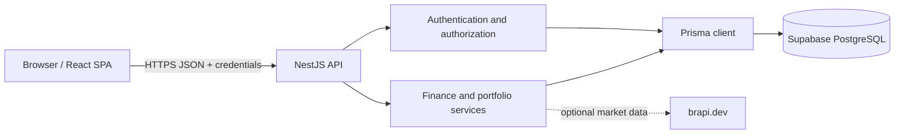

# FinanceBuddy Security Review

**Review date:** 2026-08-21

**Scope:** React web application, NestJS API, Prisma data access, Supabase SQL migrations, automated tests, and GitHub Actions workflows in this repository.

## Executive summary

FinanceBuddy uses a server-mediated architecture appropriate for user-owned financial data: the React application calls a NestJS API, and only the API accesses PostgreSQL through Prisma. The strongest implemented property is consistent user scoping across financial resources, supported by authorization tests for transactions, budgets, goals, assets, portfolios, dividends, and reports.

Authentication uses Argon2id password hashes, short-lived JWT access tokens held in application memory, and hashed refresh tokens delivered through HttpOnly cookies. Refresh rotation, token-family reuse detection, explicit CSRF validation, request validation, throttling, production error filtering, and security-event recording provide defense in depth.

This is a repository-level review, not an independent penetration test or a production certification. Runtime configuration, Supabase settings, proxy behavior, secret management, log retention, backup recovery, and incident response must still be validated in each deployed environment.

## Architecture and trust boundaries



Key boundaries:

- The browser is untrusted. It does not receive database credentials or connect directly to Supabase tables.
- The API is the authorization boundary for financial resources and administrative security events.
- PostgreSQL stores credentials, session state, user-owned finance records, portfolio events, and audit/security metadata.
- brapi.dev is an external data source. Quote data is treated as provider data, not an authorization source.
- CI dependencies and npm packages are part of the software supply-chain boundary.

## Primary threats

| Threat | Potential impact | Current treatment |
| --- | --- | --- |
| BOLA/IDOR across financial resources | Cross-user disclosure or modification of sensitive records | User-scoped repository queries, ownership assertions, anti-enumeration responses, and dedicated authorization tests |
| Credential theft or weak password storage | Account takeover | Argon2id, optional server-side pepper, password policy validation, login throttling, and security events |
| Access/refresh token theft or replay | Session compromise | Short-lived in-memory access tokens, HttpOnly refresh cookies, hashed refresh-token storage, rotation, family tracking, reuse detection, and revocation |
| CSRF against cookie-authenticated routes | Unauthorized refresh or logout actions | Double-submit CSRF token, `X-Requested-With`, and production Origin/Referer checks |
| Brute force or resource exhaustion | Availability loss and authentication abuse | Global throttling, stricter route limits, request-size limits, pagination bounds, and cached report work |
| Injection or malformed financial input | Corrupted calculations, persistence abuse, or client injection | DTO allowlisting, rejection of unknown fields, financial bounds, Prisma parameterization, and constrained dynamic chart styles |
| Security misconfiguration | Exposed docs, permissive CORS, spoofed IPs, or unsafe cookies | Production Swagger guard, exact-origin CORS support, explicit proxy trust, cookie topology guidance, Helmet, and deployment checklist |
| Supply-chain or secret exposure | Compromised builds or leaked credentials | Locked npm dependency graph, blocking audit, Dependabot, Gitleaks, Semgrep CE, and pinned Trivy action |

## Control evidence

| Control | Repository evidence |
| --- | --- |
| Password hashing, JWT issuance, refresh rotation, reuse handling, and cookies | [`auth.service.ts`](../../apps/api/src/modules/auth/auth.service.ts), [`auth.repository.ts`](../../apps/api/src/modules/auth/auth.repository.ts), [`auth.service.spec.ts`](../../apps/api/test/auth.service.spec.ts) |
| JWT signature, issuer, audience, and expiry validation | [`jwt-auth.guard.ts`](../../apps/api/src/common/guards/jwt-auth.guard.ts), [`jwt-auth.guard.spec.ts`](../../apps/api/test/jwt-auth.guard.spec.ts) |
| CSRF token and origin checks | [`csrf-protection.guard.ts`](../../apps/api/src/common/guards/csrf-protection.guard.ts), [`api.ts`](../../apps/web/src/lib/api.ts), [`csrf-protection.guard.spec.ts`](../../apps/api/test/csrf-protection.guard.spec.ts) |
| User-scoped financial authorization | [`resource-assertions.ts`](../../apps/api/src/common/services/resource-assertions.ts), [`authorization.service.spec.ts`](../../apps/api/test/authorization.service.spec.ts), [`reports.controller.integration.spec.ts`](../../apps/api/test/reports.controller.integration.spec.ts) |
| Input, body, CORS, proxy, Helmet, and Swagger controls | [`main.ts`](../../apps/api/src/main.ts), [`financial-values.ts`](../../apps/api/src/common/validators/financial-values.ts), [`financial-dto-validation.spec.ts`](../../apps/api/test/financial-dto-validation.spec.ts) |
| Throttling with security-event integration | [`audited-throttler.guard.ts`](../../apps/api/src/modules/security/audited-throttler.guard.ts), [`audited-throttler.guard.spec.ts`](../../apps/api/test/audited-throttler.guard.spec.ts) |
| Sanitized security-event persistence and restricted review API | [`security-event.service.ts`](../../apps/api/src/modules/security/security-event.service.ts), [`security-admin.guard.ts`](../../apps/api/src/modules/security/security-admin.guard.ts), [`security-events.controller.integration.spec.ts`](../../apps/api/test/security-events.controller.integration.spec.ts) |
| Database role/RLS hardening for custom auth tables | [`20260531120000_harden_custom_auth_tables.sql`](../../supabase/migrations/20260531120000_harden_custom_auth_tables.sql), [`20260531124000_add_security_events.sql`](../../supabase/migrations/20260531124000_add_security_events.sql) |
| Dynamic chart-style injection constraints | [`chart.tsx`](../../apps/web/src/components/ui/chart.tsx), [`chart-security.test.ts`](../../apps/web/test/chart-security.test.ts) |
| Quality and supply-chain gates | [`ci.yml`](../../.github/workflows/ci.yml), [`security.yml`](../../.github/workflows/security.yml), [`dependabot.yml`](../../.github/dependabot.yml) |

## Automated verification

The local quality gate is:

```bash
npm run check
npm audit --audit-level=high
```

`npm run check` runs API and web tests, web linting, API and web typechecking, and both production builds. The test suite covers authentication, refresh rotation, authorization boundaries, CSRF, DTO validation, portfolio calculations, reporting, throttling, security-event handling, and protected web routes.

GitHub Actions adds blocking repository scans:

- Gitleaks for committed secret detection.
- Semgrep Community Edition with the OWASP Top Ten ruleset and error-on-findings behavior.
- Trivy filesystem scanning for fixed high and critical vulnerabilities.
- `npm audit --audit-level=high` for the locked npm dependency graph.

Automated checks provide regression evidence for the committed source tree. They do not prove that a deployed environment uses the documented CORS, cookie, proxy, database, or secret-management settings.

## Residual risks

- **No MFA:** Password and session controls are implemented, but a compromised primary credential is not protected by a second factor.
- **Live-browser compromise:** Keeping access tokens in memory avoids persistent browser storage, but an active XSS compromise could still access application state or make authenticated requests.
- **Process-local rate limits:** The repository does not configure a distributed throttling store. Multi-instance deployments must verify that aggregate limits remain effective.
- **External market data:** Availability, correctness, and rate limits of brapi.dev remain external dependencies. Mock fallback data must remain clearly identified and should be disabled for production decision-making.
- **Deployment-dependent cookies and origins:** Correct `SameSite`, HTTPS, CORS, and trusted-proxy behavior depends on the final web/API topology.
- **Operational security events:** Events are persisted and reviewable, but the repository does not supply a production alerting pipeline, retention job, or incident-response integration.
- **Supply-chain snapshots:** Versioned actions and a clean npm audit reduce known risk at review time; new advisories and compromised upstreams remain possible.

## Manual and operational gaps

The following items cannot be considered complete through repository automation alone:

1. **MFA design and verification** — select an enrollment, recovery, and step-up authentication model; implement it in API and UI; then perform abuse-case testing.
2. **Deployment validation** — verify exact CORS origins, cookie attributes, TLS, trusted proxy hops, disabled production Swagger, database role grants/RLS, secret storage, and real client-IP handling in every environment.
3. **Retention, monitoring, and response** — define security-event retention, alert thresholds, reviewer access, on-call ownership, incident procedures, backup testing, and recovery objectives.
4. **Independent assessment** — arrange an external code review and penetration test before treating FinanceBuddy as production financial infrastructure.

The detailed deployment checks are maintained in [`DEPLOYMENT_SECURITY.md`](./DEPLOYMENT_SECURITY.md), and implementation requirements are tracked in [`SECURITY_REQUIREMENTS.md`](./SECURITY_REQUIREMENTS.md).

## Conclusion

FinanceBuddy demonstrates a credible security-first architecture for an open-source portfolio: server-side data access, explicit ownership enforcement, hardened session handling, layered request controls, security telemetry, and blocking quality/security automation. Its remaining gaps are primarily authentication depth, deployment assurance, operational maturity, and independent validation. Those gaps should remain explicit rather than being represented as controls the repository cannot prove.
